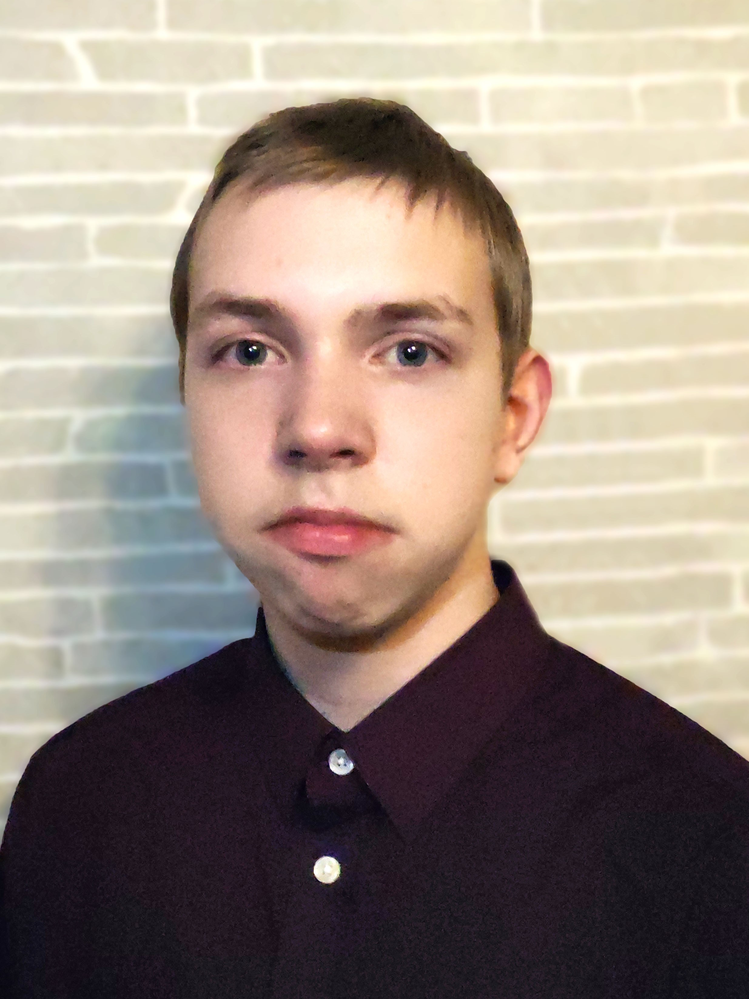

# Mans CV
**Ivars Žeibe** 

## Izglītība
* 2020.–pašlaik	PIKC „Rīgas Valsts tehnikums”, programmēšana
* 2011.–2020.	Rīgas 25. vidusskola

## Sasniegumi
Gads|Sasniegums|Papildus
----|----------|-----
2020.|3. vieta Rīgas pilsētas fizikas 70. olimpiādē
2019.|3. vieta Rīgas pilsētas matemātikas 69. olimpiādē
2018.|3. Latvijas 45. atklātajā matemātikas olimpiādē
2016.|2. vieta Rīgas pilsētas matemātikas 66. olimpiādē
2014.|1. vieta Latvijā galvā rēķināšanas konkursā "Miksike" 1-3 klašu grupā |[Wikipēdija](https://lv.wikipedia.org/wiki/R%C4%93%C4%B7ini_galv%C4%81)

## Hobiji
* Mazu spēļu un uzdevumu programmēšana
* Programmēšanas prasmju uzlabošana
* Kalnu slēpošana
* Slēpošana
* Datorpsēļu spelēšana
* Teniss
## Pieredze programmēšanā
### Programmēšanas valodas
* Scratch
    * Pamatskolā sākot ar 7. klasi vajadzēja strādāt ar šo vizuālo programmēšanas valodu, pildot dažādus uzdevumus no mājaslapas [Start(IT)](https://www.startit.lv/), lai apgūte programmēšanas pamatus.
    * PIKC Rīgas Valsts tehnikumā algoritmēšanas un programmēšanas pamatos pirmos divus mēnešus bija jāstrādā ar šo programmēšanas valodu un jāiesniedz tēmas gala darbs, kurā bija jāizstrādā programmā Scratch programmēšanas vidē.
    * Patstāvīgi esmu taisījis nelielas spēles paša prieka pēc.
* C#
    * Patstāvīgi esmu apguvis šīs programmēšanas pamatus, ar tīmekļa pamācību un paša eksperimentēšanas palīdzību. Šajā programmēšanas valodā es esmu izstrādājis 2 spēles: čūskiņu un tetri, kā arī iesācis projektus.
* Python
    * PIKC Rīgas Valsts tehnikumā algoritmēšanas un programmēšanas pamatos bija jāmācas Python, pildot dažādus uzdevumus. Bija jāveic projektēšanas daļa, kurā ir iekļauta blokshēma, matemātiskais apraksts un citas lietas. Pēc tam bija jātaisa atbilsotšs skripts caur IDLE programmēšanas vidi.
### Programmēšanas vides
* Unity
    * Patstāvīgi esmu izmantojis šo vidi kopā ar C# programmēšanas valodu. Tajā es esmu strādājis maz, uztaisot mazas spēles pēc pamācības.
* Visual Studio
    * Esmu izmantojis galvenokārt ar C# programmēšanas valodu, lai izstrādātu spēles: tetris, čūskiņa. Esmu arī iesāci dažādus prokjektus un izmantojis Visual Studio iespējau pārvaldīt projektu izmantojot git.
    * Šajā programmēšanas vidē arī ir ielādētas C++ un C# programmēšanas valodas, taču ar tām es šajā vidē neesmu neko nopitni taisījis, tikai atvēris failus, kas ir rakstīti atbilstošajās valodās.
* IDLE
    * Es izmantoju šo programmēšanas vidi, lai rakstītu visus skriptus, kurus rakstu Python valodā.
* Visual Studio Code
    * Esmu tikai sācis apgūt šo programmēšanas vidi.